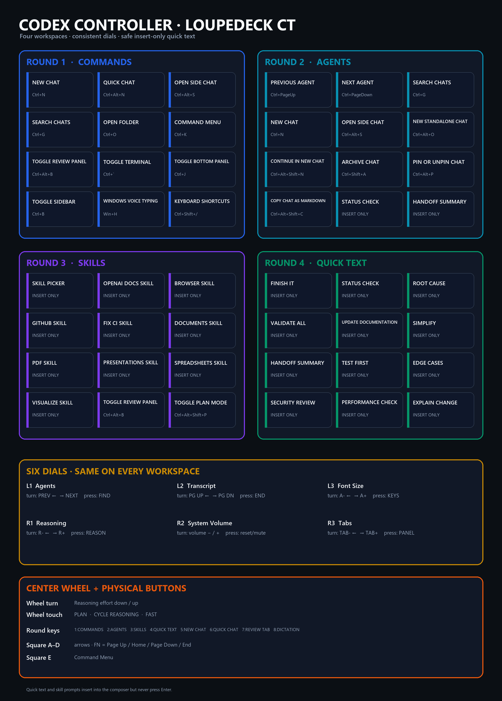

# Codex Controller for Loupedeck CT

A polished four-page Loupedeck CT profile for the Codex Windows app, inspired by the Codex Micro. It provides Codex commands, task navigation, reusable skill prompts, quick text, dials, wheel controls, keyboard shortcuts, and custom Lucide/shadcn-style icons.



## Features

- Four touchscreen pages: Commands, Agents, Skills, and Quick Text.
- Six consistent dial assignments plus Plan, Reasoning, and Fast controls on the center wheel.
- Custom, editable Lucide-style SVG icons on black unboxed backgrounds.
- Direct shortcuts for Reasoning, Plan, Fast, Continue in New Chat, and Copy as Markdown.
- Windows Voice Typing (`Win+H`) for reliable press-on/press-off dictation.
- Insert-only skill and quick-text prompts: they do not press Enter or approve anything automatically.
- Automatic profile switching when the Codex `ChatGPT.exe` window is active.

## Requirements

- Windows 11.
- Codex desktop app for Windows.
- Loupedeck CT and the current Loupedeck configuration software.
- Python 3 and Pillow only if you want to edit and rebuild the profile.

The supplied profile targets Loupedeck device family `Loupedeck20` and the Codex process identifier `chatgpt` (`ChatGPT.exe`). Other Loupedeck models and macOS have not been tested.

## Installation

### 1. Download the project

Clone the repository or download it as a ZIP, then extract it. The ready-to-import profile is:

[`dist/Codex-Controller.LP4`](dist/Codex-Controller.LP4)

### 2. Back up your current configuration

Before importing anything:

1. Open the Loupedeck configuration application.
2. Export any Loupedeck profiles you want to preserve.
3. Back up your existing Codex keybindings if the file exists:

```powershell
$target = Join-Path $HOME ".codex\keybindings.json"
if (Test-Path $target) {
    Copy-Item $target "$target.backup-$(Get-Date -Format 'yyyyMMdd-HHmmss')"
}
```

### 3. Install or merge the Codex keybindings

The Loupedeck profile expects the eight bindings in [`src/codex-keybindings.json`](src/codex-keybindings.json). The following PowerShell script preserves unrelated existing bindings and replaces only matching command IDs:

```powershell
$templatePath = Resolve-Path ".\src\codex-keybindings.json"
$targetPath = Join-Path $HOME ".codex\keybindings.json"
$targetDirectory = Split-Path $targetPath

New-Item -ItemType Directory -Path $targetDirectory -Force | Out-Null
$template = @(Get-Content $templatePath -Raw | ConvertFrom-Json)
$existing = if (Test-Path $targetPath) {
    @(Get-Content $targetPath -Raw | ConvertFrom-Json)
} else {
    @()
}

$managedCommands = @($template | ForEach-Object command)
$merged = @($existing | Where-Object command -NotIn $managedCommands) + $template
$merged | ConvertTo-Json -Depth 5 | Set-Content $targetPath -Encoding utf8
```

Restart Codex once after creating or changing `~/.codex/keybindings.json`.

The installed bindings are:

| Codex command | Shortcut |
|---|---|
| Decrease reasoning effort | `Ctrl+Alt+Shift+Down` |
| Increase reasoning effort | `Ctrl+Alt+Shift+Up` |
| Cycle reasoning effort | `Ctrl+Alt+Shift+R` |
| Toggle Plan mode | `Ctrl+Alt+Shift+P` |
| Toggle Fast mode | `Ctrl+Alt+Shift+F` |
| Native push-to-talk dictation | `Ctrl+Shift+D` |
| Continue in New Chat / Fork | `Ctrl+Alt+Shift+N` |
| Copy conversation as Markdown | `Ctrl+Alt+Shift+C` |

### 4. Import the Loupedeck profile

1. Open the Loupedeck configuration application.
2. Open profile management and choose **Import**.
3. Select `dist/Codex-Controller.LP4`.
4. Associate it with Codex or `ChatGPT.exe` if Loupedeck asks.
5. Make **Codex Controller** the default profile for that application.
6. Enable automatic application following/profile switching.

When Codex is focused, Loupedeck should select the `chatgpt` application profile. When another application is focused, it should return to that application's profile or System.

### 5. Test the installation

Open Codex, focus the message composer, and work through [`docs/manual-test-checklist.md`](docs/manual-test-checklist.md). At minimum, verify:

- all four touchscreen pages open;
- New Chat, Search, Review, Fork, and Copy Markdown work;
- the dials turn in the expected direction;
- Plan, Reasoning, and Fast change state;
- `Win+H` starts and stops Windows Voice Typing;
- skill and quick-text buttons insert text without submitting it.

## Dictation behavior

Codex's native `Ctrl+Shift+D` command is push-to-talk: it listens only while the keys are physically held. A normal Loupedeck shortcut sends an atomic press/release and therefore cannot reproduce that lifecycle reliably.

The touchscreen and round Dictate controls use Windows Voice Typing (`Win+H`) instead. Press once to start and again to stop. `Ctrl+Shift+D` remains in the supplied keybindings for use from a physical keyboard.

## Troubleshooting

### The profile does not switch when Codex opens

- Confirm Task Manager shows the Codex process as `ChatGPT.exe`.
- Confirm the imported Loupedeck application profile is enabled and associated with Codex.
- Enable **Follow active application** in Loupedeck.
- Restart the Loupedeck service or configuration application after changing the association.

### Reasoning, Plan, Fast, Fork, or Copy Markdown does nothing

- Confirm the eight entries are present in `%USERPROFILE%\.codex\keybindings.json`.
- Restart Codex after changing that file.
- Open **Settings → Keyboard Shortcuts** and confirm the intended shortcut appears.
- Test the shortcut on the physical keyboard before testing Loupedeck.

These commands are configurable Codex shortcuts but are not necessarily shown in the Command Menu.

### Quick Text or Skills does not insert text

These controls use Loupedeck text macros. Click inside the Codex message composer first. They intentionally do not press Enter. Text insertion and physical keystroke delivery still require manual device testing.

### Dictation stops immediately

Use the Loupedeck Dictate control mapped to `Win+H`. Do not replace it with native `Ctrl+Shift+D` unless the controller can hold the key combination for the full recording.

## Layout and reference files

- [`docs/layout-reference.png`](docs/layout-reference.png) — complete printable layout.
- [`docs/shortcut-reference.md`](docs/shortcut-reference.md) — every touchscreen, dial, wheel, and physical-button mapping.
- [`docs/icon-preview.png`](docs/icon-preview.png) — icon reference.
- [`docs/codex-custom-shortcuts.md`](docs/codex-custom-shortcuts.md) — details about the custom Codex bindings.
- [`docs/manual-test-checklist.md`](docs/manual-test-checklist.md) — physical verification checklist.

## Editing and rebuilding

Edit [`src/profile.json`](src/profile.json) to change actions, mappings, prompts, labels, or colors. SVG sources are under [`src/icons`](src/icons).

Install the build dependency and rebuild:

```powershell
py -m pip install Pillow
py tools\build_profile.py
```

The generator recreates:

- `dist/Codex-Controller.LP4`;
- `dist/package/`;
- editable SVG icon sources;
- the layout and shortcut reference sheets.

The generator uses stable action IDs, so unchanged controls retain their IDs between builds. Review the generated reference files and repeat the physical checklist after every material mapping change.

## Project structure

```text
dist/Codex-Controller.LP4     Ready-to-import profile
src/profile.json              Editable controller definition
src/codex-keybindings.json    Mergeable Codex shortcut definitions
src/icons/                    Editable SVG icons
tools/build_profile.py        Profile and documentation generator
docs/                         Layout, shortcuts, icons, and test checklist
```

## Safety notes

- Back up existing profiles and keybindings before installation.
- Do not overwrite an existing keybindings file without merging unrelated entries.
- No button grants permissions or approves a Codex action.
- Skill and quick-text controls insert text only.
- Dynamic agent status and context-aware lighting would require a native Codex/Loupedeck integration and are not implemented here.
